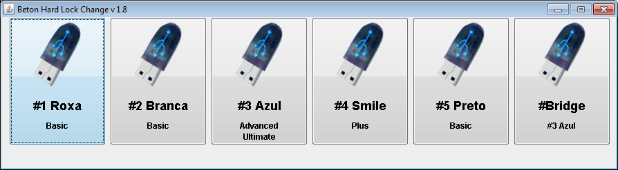

# BetonKey.

Programa criado para gestão de arquivos de licensas do SAP.

## Screenshots

### Tela de login

## Descrição
- Projeto criado utilizando NetBeans

## Licença MIT
Licença MIT [MIT License](LICENSE)
